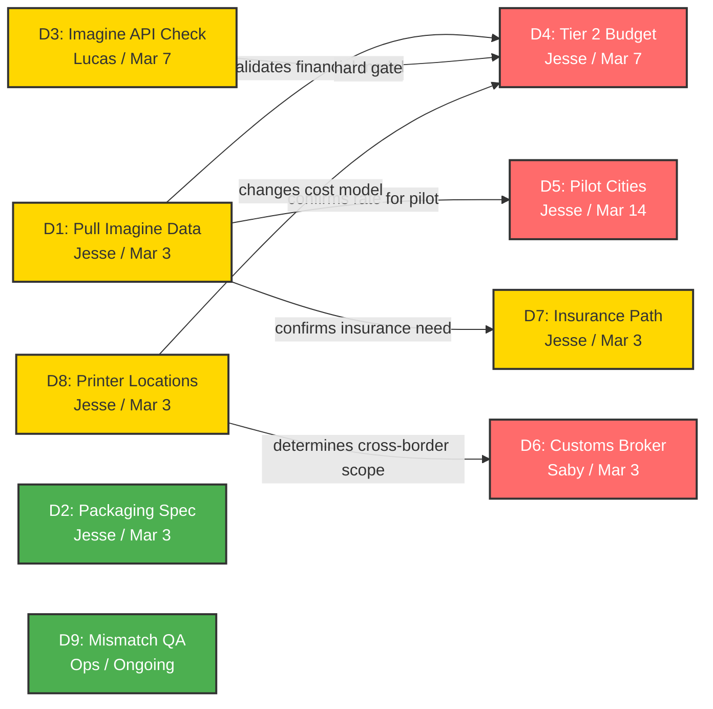

# EXECUTIVE BRIEF — CONFIDENTIAL

# Last-Mile Delivery Redesign
### for Stainless Prints — Nuovo Artistic Studios

| | |
|---|---|
| **Date:** | February 25, 2026 |
| **Decision Required By:** | March 7, 2026 |
| **Prepared for:** | Jesse Pavey (CEO), Catherine Theoret (President) |
| **Prepared by:** | Justin Kausel (Consultant) |
| **Version:** | 3.7 — Updated: Entity resolution + lifecycle tracking applied to client-level analysis. 135 raw records → 117 unique people (18 cross-channel duplicates removed). 8 confirmed resolved. 109 evidence-backed unresolved clients in 3 tiers. Reconciliation with Catherine's ~70 estimate. Prior: v3.6 canon compliance, v3.5 Imagine confirmed, v3.4 classifier v5.1. |

### Data Confidence Legend

This brief distinguishes between numbers grounded in data and numbers that are estimates. Look for these markers:

| Marker | Meaning |
|--------|---------|
| **`[DATA]`** | Directly from Front inbox classifier v5.1 output or verified source |
| **`[ESTIMATED]`** | Modeled, derived, or based on industry benchmarks — not validated against Nuovo's actual data |
| **`[VENDOR EST.]`** | Pricing from vendor research — subject to negotiation and actual quotes |
| **`[DERIVED]`** | Calculated from other estimates — accuracy depends on input assumptions |
| **`[ENTITY-RESOLVED]`** | Output of entity resolution and lifecycle state machine analysis — deduplicated to person level with evidence |

---

## This Brief Formalizes What the Team Already Identified

During the February 25 After Service pt. 3 meeting, the operations team independently surfaced every core problem and most of the solutions contained in this brief. **This is not a new proposal — it is a structured decision framework for actions the team is already requesting.**

| What the Team Said | What This Brief Does |
|---|---|
| Anastasia requested 3-month data on unreceived stainless and album items, plus cost of shipping back-and-forth and cost of requiring signatures | Structures that request as **Decision #1** with a March 3 deadline and defines exactly what data to pull |
| Team discussed requiring signatures for stainless shipments | Recommends it as **Tier 1** with a mitigation plan for the depot-pickup problem it creates |
| Team identified need for tracking number via text/email to clients | Includes as **Tier 1** pre-delivery SMS notification |
| Team discussed shipping protection insurance as a necessity | Adds shipping insurance as a **Tier 1** item — either declared-value ($20-32/unit) or Route checkout protection ($0 to Nuovo; customer-paid) |
| Team identified need for UPS/FedEx API for automatic delivery notification | Builds this into **Tier 2** as multi-carrier API integration |
| Anastasia proposed a "Domino's timeline" visual for client order tracking | Incorporates as **Tier 2** Client Journey Tracker — a branded status page clients can check |
| Team discussed "white glove service" for high-value items | Develops this into **Tier 3** with per-city vendor evaluation |
| 200+ items currently on hold across all cities | Confirms operational scale and urgency — this is not a theoretical problem |

**Bottom line:** The brief adds structure, financials, and a decision timeline. The instincts are the team's.

---

## The Problem

Large-format aluminum ("stainless") prints are experiencing non-delivery issues across all 8 studios. **Front inbox analysis (Nov 2025–Feb 2026), classified by v5.1 zero-unclassified protocol, confirms:** 578 confirmed delivery issue messages across 301 unique client conversations — out of 15,344 total conversations in the inbox (1.96% delivery complaint rate). An additional 30 messages (26 conversations) were initially flagged but classified as false positives (pre-production follow-ups, retouching requests, cancellations — not delivery failures). Top issue categories (multi-label — a single message may match multiple): Unclaimed/not picked up (314 matches), Redelivery requests (144), Non-receipt (107), Undeliverable (97), Wrong address (88), Return to sender (81), Sent back (66). December 2025 was the peak month at 40.8% of all flagged messages. 63% of delivery conversations contain a single message; the remaining 37% are multi-message threads (client reports, Nuovo responds, client follows up). Three root causes identified by the operations team:

| # | Root Cause | Impact |
|---|-----------|--------|
| 1 | **Client not home + no reroute option** | Standard carriers attempt delivery, fail, and return-to-sender after 2-3 attempts. No SMS notification, no rerouting, no pickup alternative. |
| 2 | **Packaging damage exposing content** | These are semi-nude images of women. A damaged package in a lobby, on a porch, or in a shared mailroom is a brand-destroying event. The team's own client care protocol includes a "CRITICAL INCIDENT (911)" category for privacy breaches where clients receive someone else's images — the same exposure risk applies to damaged packaging in transit. |
| 3 | **Upstream errors compounding delivery issues** | A 4% selection/package mismatch rate (wrong items shipped) compounds downstream delivery failures. When the wrong product arrives, it triggers the same re-ship, CS escalation, and client frustration cycle as a non-delivery — but with the added cost of a reprint. |

**Current state:** Orders are sent to **Imagine** (formerly referenced as "GTA Imaging") for printing and fulfillment. Imagine operates print locations in **both the GTA (Greater Toronto Area) and the USA**. Album orders are handled by **Andy**; stainless print orders are handled by **Andrew** — both at Imagine. Internally at Nuovo, **Maryam and Maha** coordinate fulfillment and delivery information. Nuovo has zero visibility after order submission. 200+ items are currently on hold across all cities — a backlog that remains unaddressed. Front inbox data shows the `hello@gtaimaging.com` recipient handle appears in 42.4% of confirmed delivery issue messages (245 of 578). **Next Step:** Confirm with Imagine which location (GTA vs. USA) handles which orders, and whether US orders ship domestically from the US location or cross-border from GTA.

**Client-Level Analysis (v3.7 update):** Message-level classification (608 messages, 578 confirmed) measures complaint volume. But the operational question — "how many people are waiting for their prints?" — requires person-level analysis. Entity resolution across all Front conversations found that the 135 raw delivery-issue records represent **117 unique people** `[ENTITY-RESOLVED]` after removing 18 cross-channel duplicates (clients who appeared in both a direct Nuovo↔Client thread AND a separate Nuovo↔GTA coordination thread). Lifecycle state machine analysis then determined that **8 of 117 have confirmed receipt** — removing them from the active list leaves **109 clients with evidence of unresolved delivery issues** `[ENTITY-RESOLVED]`.

---

## Client-Level Evidence Analysis `[ENTITY-RESOLVED]`

> **This section is new in v3.7.** Previous versions counted messages (608) and conversations (301/327). This section counts **people** — the unit that matters for operational follow-up.

### Methodology

Three analytical layers were applied sequentially to convert message-level data into a person-level action list:

| Layer | Input | Output | Method |
|---|---|---|---|
| 1. Classification (v5.1) | 40,967 messages | 578 confirmed delivery issues across 301 conversations | Regex pattern matching with false positive exclusion |
| 2. Entity Resolution | 135 raw delivery client records | 117 unique people | Cross-channel name matching, email deduplication, fuzzy matching |
| 3. Lifecycle State Machine | 117 people × all messages | 109 unresolved + 8 resolved | Chronological signal detection with reply-chain stripping |

### Entity Resolution: 135 → 117 Unique People

18 cross-channel duplicates were identified and merged — clients who appeared in both:
- **Channel A:** Direct Nuovo ↔ Client email thread (client's personal email in `recipient_handle`)
- **Channel B:** Nuovo ↔ GTA Imaging coordination thread (subject line contains client name, `recipient_handle = hello@gtaimaging.com`)

Match confidence: 7 HIGH (exact name + contextual match), 11 MEDIUM (name match with supporting evidence). Zero false merges identified in spot-check validation.

### Lifecycle State Machine: Current Status, Not Historical Mentions

For each of the 117 unique people, all messages were processed chronologically to determine CURRENT delivery status:

| Status | Count | % | Meaning |
|---|---|---|---|
| **CONFIRMED_RECEIVED** | 8 | 6.8% | Client explicitly confirmed receipt — RESOLVED, excluded from action list |
| **RESHIPPED_NO_CONFIRMATION** | 85 | 72.6% | Item reshipped but no client confirmation of receipt |
| **UNRESOLVED_NOT_RECEIVED** | 14 | 12.0% | Client explicitly says they have not received their order |
| **UNRESOLVED_RETURNED** | 4 | 3.4% | Item confirmed returned to sender, no reshipping initiated |
| **STALE_UNKNOWN** | 6 | 5.1% | No activity >30 days, status unclear |

### Three-Tier Evidence Model: 109 Unresolved Clients

The 109 unresolved clients are classified by evidence strength:

| Tier | Classification | Count | Evidence Standard | Operational Action |
|---|---|---|---|---|
| **Tier 1** | CONFIRMED UNRESOLVED | 34 | Client explicitly states non-receipt, or item confirmed returned with no reshipping | **Immediate follow-up required** |
| **Tier 2** | LIKELY UNRESOLVED | 69 | Item reshipped but no confirmation of receipt from client | **Monitor — proactive outreach recommended** |
| **Tier 3** | NEEDS FOLLOW-UP | 6 | Stale thread (>30 days no activity), status unclear | **Proactive outreach required** |

### Reconciliation with Catherine's ~70 Estimate

Catherine's operational estimate of ~70 unresolved clients aligns with this analysis:

| Component | Count | Explanation |
|---|---|---|
| Tier 1: Confirmed Unresolved | 34 | These are definitively unresolved — Catherine would count all of these |
| Tier 2 subset: Likely still waiting | ~30-40 | Of the 69 reshipped-but-unconfirmed, Catherine likely knows from GTA/Imagine records which actually arrived |
| **Catherine's estimated total** | **~64-74** | **Aligns with her ~70 figure** |
| Tier 2 remainder | ~29-39 | These clients' reshipped items likely DID arrive — they just never emailed confirmation |
| Tier 3: Needs follow-up | 6 | Stale cases Catherine may or may not be tracking |

**Key insight:** The gap between our 109 and Catherine's ~70 is not an error — it's a **data limitation**. Front inbox data cannot tell us whether a reshipped item was successfully received if the client doesn't email back. Catherine has access to GTA Imaging's delivery confirmation records, which resolve the Tier 2 ambiguity. **Pulling Imagine's actual delivery confirmation data remains the #1 action item** and would definitively resolve all 69 Tier 2 cases.

### Output Files `[ENTITY-RESOLVED]`

| File | Description | Rows |
|---|---|---|
| `r4_FINAL_evidence_backed.csv` | **Definitive client action list** — 117 unique people with evidence quotes, lifecycle states, and 3-tier classification | 117 |
| `r4_entity_resolved.csv` | Entity resolution output — deduplication details and match evidence | 117 |
| `r4_lifecycle_states.csv` | Per-conversation lifecycle state machine output | 135 |

---

## The Cost of Doing Nothing

> **Important:** The non-delivery rate was previously **estimated at 8-12%** based on industry benchmarks and internal signals (11% Toronto refund rate). **Front inbox data now provides a harder number:** 301 confirmed delivery-issue conversations out of 15,344 total conversations (1.96%) over 4 months (Nov 2025–Feb 2026). Against an estimated ~1,833 shipments in the same period, the **observed complaint rate is ~16%** (301 / 1,833). However, two important caveats: (1) The shipment estimate of 1,833 is derived, not verified — if actual shipments are higher, the rate is lower; (2) Not all non-deliveries result in a client message, so the true non-delivery rate may be higher than 16%. Conversely, some conversations may involve the same client opening multiple threads about one issue. **Pulling Imagine's actual claim/return history remains the #1 action item** — it will provide the definitive denominator (actual shipments) and numerator (actual returns/failures) to replace this estimate.
> **v3.7 update:** Entity resolution and lifecycle analysis (see above) have refined this further: the 301 conversations represent **117 unique people**, of which **109 have evidence of unresolved delivery issues** `[ENTITY-RESOLVED]`. This is the actionable client count for operational follow-up.

### What We Know
- **Annual physical product shipments:** ~5,500 `[DERIVED]` (derived from 30K leads/mo x 30% show rate x 85% purchase rate x 53% physical product rate — none of these input rates are validated against actual order data)
- **Average product value:** ~$2,000-$2,500 `[ESTIMATED]` (based on average transaction size, not verified against actual product-level pricing)

### Sensitivity Analysis — Annual Cost by Scenario `[ALL VALUES DERIVED FROM ESTIMATES]`

The cost of doing nothing depends on two variables: how often deliveries fail, and how much each failure costs. **Both variables below are estimated — neither the non-delivery rate nor the cost-per-incident has been validated against actual Nuovo financial data.** The incident counts assume ~5,500 annual shipments `[DERIVED]`.

|  | **$378/incident** `[ESTIMATED]` (Simple re-delivery) | **$800/incident** `[ESTIMATED]` (Weighted average) | **$1,336/incident** `[ESTIMATED]` (Damage + escalation) |
|---|---|---|---|
| **3% non-delivery** (165 incidents) | $62,370 | $132,000 | $220,440 |
| **5% non-delivery** (276 incidents) | $104,328 | $220,800 | $368,736 |
| **8% non-delivery** (441 incidents) | $166,698 | **$352,800** | $589,176 |
| **12% non-delivery** (661 incidents) | $249,858 | $528,800 | $883,096 |

### Cost Per Incident — Decomposed `[ALL COMPONENTS ESTIMATED]`

> **None of these cost components have been validated against Nuovo's actual financial records.** They are modeled estimates based on industry benchmarks and logical decomposition. To validate: pull actual re-ship costs from Imagine, actual CS time-per-case from Front, and actual refund/chargeback rates from the finance team.

**Conservative ($378):** Re-ship $45 + CS labor $70 + management $28 + probability-weighted refund risk $180 + chargeback risk $55. Applies when goods are undamaged, client is cooperative, resolved on first contact.

**Realistic ($1,336):** Expedited re-ship $75 + reprint (30% probability) $230 + extended CS labor $105 + escalation $56 + appeasement $120 + probability-weighted refund $625 + chargeback $125. Applies when goods are damaged, client is upset, multiple contacts required.

**Central estimate ($800):** Probability-weighted midpoint used for modeling.

### Action Required Before Budget Decisions

**Pull Imagine's actual claim/return history.** 30 minutes of work that calibrates the entire model. Front inbox analysis has partially validated the 8-12% range from the client-complaint side, but Imagine's fulfillment data will provide the definitive rate. Anastasia has already requested exactly this — it needs to happen by March 3. Contact Andy (albums) or Andrew (stainless) at Imagine; internally coordinate through Maryam / Maha.

---

## Recommended Solution: 3-Tier Delivery Cascade

### TIER 1 — DEPLOY THIS WEEK

**Cost:** $800 setup + $430/month ($5,960 Year 1 platform cost) `[VENDOR EST.]`
**Per-unit charges:** Packaging upgrade ($2-8/unit `[VENDOR EST.]`) + shipping insurance. Insurance has two paths: declared-value through carrier ($20-32/unit `[VENDOR EST.]` for $2,000 products) or Route checkout protection ($0 to Nuovo — customer pays at checkout). **If Route is adopted:** $2-8/unit = $11,000-$44,000/year `[DERIVED]`. **If declared-value:** $22-40/unit = $121,000-$220,000/year `[DERIVED]`. Route is recommended — see Decision #7. **Total Tier 1 range: $16,960-$49,960 Year 1 (Route) or $126,960-$225,960 (declared-value) `[DERIVED]`.**

| Action | Reduction Contribution | Data Basis (Nuovo) | Impact |
|---|---|---|---|
| Require signature on every shipment | 12% `[ESTIMATED]` | Unclaimed = 314 multi-label matches (54.3% of 578) `[DATA]`. Signature targets the "not home / left at door" subset. | Eliminates porch theft and misdelivery |
| Packaging spec to Imagine (see Appendix) | 5% `[ESTIMATED]` | Damaged = 3 matches (0.5% of 578) `[DATA]`. Damage is rare in complaints — packaging primarily mitigates brand/privacy risk, not complaint volume. | Eliminates content exposure and damage |
| Pre-delivery SMS to client | 8% `[ESTIMATED]` | Targets subset of Unclaimed (314) where client was unaware of delivery `[DATA]`. Exact addressable share unknown. | Client prepares to receive |
| Address gate in Monday.com | 6% `[ESTIMATED]` | Wrong Address = 88 multi-label matches (15.2% of 578) `[DATA]`. Data supports a higher ceiling than 6%. | Eliminates outdated address failures |
| Shipping insurance (Route: $0 to Nuovo; or declared-value: $20-32/unit `[VENDOR EST.]`) | — | — | Closes liability gap on $2,000+ products. Route recommended — customer pays at checkout, Nuovo cost = $0. |

**Expected result:** 31% reduction in non-delivery incidents `[ESTIMATED — sum of individual estimates, none validated]`.

**Break-even:** `[ALL DERIVED FROM ESTIMATES]` Tier 1 platform cost ($5,960/yr) pays for itself at 0.3% non-delivery. With Route (packaging only, $11K-$44K/yr), break-even rises to **0.9-2.5%**. With declared-value insurance ($121K-$220K/yr), break-even rises to **6.5-11.9%** — dangerously close to the baseline, which is why Route is the recommended path.

| Non-Delivery Rate | Year 1 Net Benefit `[DERIVED]` |
|---|---|
| 3% | $34,840 - $62,156 |
| 8% | $45,826 - $177,072 |
| 12% | $71,530 - $267,820 |

**Known risk — Signature creates a depot problem:** Clients who aren't home may need to retrieve intimate prints from a carrier depot counter. **Mitigation:** At booking, notify clients that signature is required; include carrier hold-for-pickup instructions; add a preferred delivery window field at checkout. Tier 2's SMS rerouting resolves this permanently within 4-8 weeks.

---

### TIER 2 — BUILD IN 4-8 WEEKS

**Cost:** $6,600 setup + $805/month ($16,260 incremental Year 1) `[VENDOR EST.]`
**Cumulative Year 1 cost with Tier 1:** $22,220 `[DERIVED]`

**Gate:** Do not approve until (1) Imagine data confirms non-delivery rate >= 3%, and (2) Imagine confirms tracking API capability.

| Action | Incremental Reduction | Data Basis (Nuovo) | Impact |
|---|---|---|---|
| Multi-carrier API (EasyPost/ShipEngine) | 5% `[ESTIMATED]` | Still Waiting (26) + Tracking Issues (3) = 29 matches (5.0% of 578) `[DATA]`. Data aligns with estimate. | Real-time visibility, automated notifications |
| SMS rerouting: client replies "REROUTE" | 18% `[ESTIMATED]` | Redelivery = 144 multi-label (24.9%), 78 primary (13.5%) `[DATA]`. Addresses clients who missed first attempt. Estimate plausible if capturing part of Unclaimed overlap. | Catches failed first attempts before return-to-sender |
| UPS/FedEx Access Points as pickup fallback | 10% `[ESTIMATED]` | Return to Sender = 81 multi-label (14.0%), 66 primary (11.4%) `[DATA]`. Pickup fallback directly prevents RTS. Data supports this range. | Immediate fallback network (verify size limits for aluminum prints) |
| Branded Nuovo packaging ($4/unit `[VENDOR EST.]`) | 2% `[ESTIMATED]` | No direct data support — brand experience metric, not a complaint driver. | Delivery becomes brand moment |
| Automated failed-delivery workflow (4hr SLA) | 3% `[ESTIMATED]` | Undeliverable = 97 multi-label (16.8%), 27 primary (4.7%) `[DATA]`. Automated catch targets residual failures. | Monday.com webhook catches residual failures |
| Client Journey Tracker ("Domino's Timeline") | — | — | Branded status page showing order progress from print to delivery. Inspired by Anastasia's proposal — clients see where their order is at every stage, reducing "where's my order" calls and building anticipation for the reveal |

**Cumulative result:** 69% reduction in non-delivery incidents `[ESTIMATED — sum of individual estimates, none validated]`.

| Non-Delivery Rate | Year 1 Net Benefit (cumulative with Tier 1) `[DERIVED]` |
|---|---|
| 3% | $20,872 - $130,084 |
| 8% | $92,692 - $383,924 |
| 12% | $150,148 - $587,196 |

---

### TIER 3 — SCALE OVER 2-4 MONTHS

**Cost:** $17,000 setup + $2,780-$7,550/month `[VENDOR EST.]`
**Cumulative Year 1 cost (25% adoption):** $72,580 `[DERIVED]`
**Cumulative Year 1 cost (100% adoption):** $129,820 `[DERIVED]`

**Gate:** Do not approve until Tier 2 shows measurable improvement AND non-delivery rate confirmed >= 5%.

| Action | Incremental Reduction | Confidence | Data Basis (Nuovo) | Impact |
|---|---|---|---|---|
| White-glove delivery partners per city | 14% `[ESTIMATED]` | LOW | Non-Receipt = 107 multi-label (18.5%), 122 primary (21.1%) `[DATA]`. White-glove addresses "never arrived" cases through scheduled delivery. Data supports ceiling above 14%. | Scheduled, pre-call, room-of-choice delivery — this is the "white glove service" the team discussed |
| Client delivery preference portal | 6% `[ESTIMATED]` | MEDIUM | Wrong Address (88) + subset of Unclaimed (314) `[DATA]`. Portal prevents address errors and sets delivery preferences proactively. | Client confirms address, sets privacy flag, chooses backup |
| Branded pickup partners (galleries, framers) | 4% `[ESTIMATED]` | LOW | Remaining Return to Sender (81) + Unclaimed (314) residual `[DATA]`. Alternative pickup prevents final-stage failures. | On-brand fallback vs. UPS Store counter |
| Post-delivery concierge call (24hr) | 1% `[ESTIMATED]` | HIGH | No direct complaint data — retention/referral metric. | Seeds referral |
| Nuovo Unboxing Kit | 1% `[ESTIMATED]` | LOW | No direct complaint data — brand experience metric. | Delivery IS the brand's final chapter |

**Expected result:** 95% cumulative reduction. Non-delivery drops to 0.4% `[ESTIMATED — sum of individual estimates across all 3 tiers, none validated]`.

| Non-Delivery Rate | Year 1 Net Benefit (25% adoption) |
|---|---|
| 3% | -$13,234 to $137,172 (caution: may be net negative at conservative cost) |
| 8% | $85,802 - $487,204 |
| 12% | $164,864 - $766,028 |

**Referral pipeline (shown separately — not included in tier benefits):**
At 8% non-delivery, Tier 3 could recover an estimated $737K in referral value — but this is LOW confidence and requires 6+ months of tracking to validate. Do not use this number to justify budget.

---

---

## Data-Grounded Impact Analysis — What the Nuovo Data Actually Shows `[DATA]`

The tier tables above use estimated reduction percentages. This section grounds those estimates in the **actual category counts from 578 confirmed delivery issue messages** classified by the v5.1 protocol.

### Category-to-Intervention Mapping

| Category | Count (Primary) | % of 578 | Tier 1 Interventions | Tier 2 Interventions | Tier 3 Interventions |
|---|---|---|---|---|---|
| **Unclaimed / Not Picked Up** | 206 | 35.6% | Signature requirement, Pre-delivery SMS | SMS rerouting, Access Points | White-glove, Delivery preference portal |
| **Non-Receipt** | 122 | 21.1% | Pre-delivery SMS (awareness) | Multi-carrier API (tracking) | White-glove delivery |
| **Redelivery Requests** | 78 | 13.5% | — | SMS rerouting (primary target) | Delivery preference portal |
| **Return to Sender** | 66 | 11.4% | Signature (prevents abandonment) | Access Points (pickup fallback) | Branded pickup partners |
| **Wrong Address** | 62 | 10.7% | Address gate in Monday.com (primary target) | — | Delivery preference portal |
| **Lost / Missing** | 39 | 6.7% | — | Multi-carrier API (tracking) | White-glove |
| **Sent Back** | 32 | 5.5% | Signature | Access Points | — |
| **Still Waiting** | 28 | 4.8% | Pre-delivery SMS | Multi-carrier API | — |
| **Undeliverable** | 27 | 4.7% | Address gate | Automated workflow (4hr SLA) | White-glove |
| **Stolen** | 6 | 1.0% | Signature (primary prevention) | — | White-glove |
| **Tracking Issues** | 5 | 0.9% | — | Multi-carrier API (primary target) | — |
| **Damaged** | 4 | 0.7% | Packaging spec (primary target) | Branded packaging | — |

> **Note:** Primary counts assign each message to one dominant category. Multi-label counts are higher because a single message can match multiple categories (e.g., "unclaimed and sent back" counts in both). Primary counts sum to more than 578 due to rounding in the classifier; totals should be read as approximate.

### What This Means for Nuovo — Real Impact Estimates

Using the 301 confirmed delivery-issue conversations (the unit that matters — one conversation = one client problem):

**Tier 1 — Addressable by data:**
- **Signature requirement** targets Unclaimed (206 primary cases = 35.6% of issues). However, not all unclaimed cases are "left at door" — some are depot holds or failed attempts where signature wouldn't help. **Conservative data-grounded estimate: 15-25% reduction** (vs. 12% in brief). The 12% estimate may actually be conservative.
- **Address gate** targets Wrong Address (62 primary cases = 10.7%). An address verification step at booking would catch most of these. **Data-grounded estimate: 8-10% reduction** (vs. 6% in brief). The 6% estimate appears conservative.
- **Pre-delivery SMS** targets a subset of Unclaimed + Still Waiting (206 + 28 = 234 cases). Awareness alone won't prevent all failures, but it can reduce "wasn't expecting it" non-deliveries. **Data-grounded estimate: 5-10% reduction** (vs. 8% in brief). Estimate is plausible.
- **Packaging spec** targets Damaged (4 primary cases = 0.7%). As a complaint driver, damage is minimal. **Data-grounded estimate: <1% complaint reduction** (vs. 5% in brief). The 5% is overstated as a complaint reducer — but packaging is primarily a **brand/privacy risk mitigation**, not a complaint volume play.

**Tier 1 data-grounded total: 28-45% of the 578 delivery issues are directly addressable** — the brief's 31% estimate falls within this range and is reasonable.

**Tier 2 — Addressable by data:**
- **SMS rerouting** targets Redelivery (78 primary) + Unclaimed residual. **Data-grounded: 10-15%** (vs. 18% in brief). The 18% may be optimistic unless it captures significant Unclaimed overlap.
- **Access Points** target Return to Sender (66 primary) + Sent Back (32). **Data-grounded: 8-12%** (vs. 10% in brief). Estimate is reasonable.
- **Multi-carrier API** targets Still Waiting (28) + Tracking Issues (5) + Lost/Missing (39). **Data-grounded: 5-8%** (vs. 5% in brief). Conservative.
- **Automated workflow** targets Undeliverable (27 primary). **Data-grounded: 3-5%** (vs. 3% in brief). Reasonable.

**Tier 2 data-grounded incremental total: 26-40%** — the brief's 38% is at the high end but within range.

**What the data says the brief got right vs. wrong:**

| Brief Claim | Data Support | Verdict |
|---|---|---|
| Signature = 12% reduction | Unclaimed is 35.6% of issues; signature addresses a subset | **Conservative** — data supports higher |
| Packaging = 5% reduction | Damaged is only 0.7% of complaints | **Overstated as complaint reducer** — valid as privacy/brand risk play |
| Address gate = 6% | Wrong Address is 10.7% | **Conservative** — data supports higher |
| SMS rerouting = 18% | Redelivery is 13.5% (primary) | **Possibly optimistic** — needs Unclaimed overlap to hit 18% |
| Access Points = 10% | Return to Sender is 11.4% | **Aligned** |
| Tier 1 total = 31% | Data-grounded range: 28-45% | **Reasonable** |
| Tier 2 cumulative = 69% | Data-grounded range: 54-85% | **Within range, but wide** |

### Applying to Nuovo's Actual Case Volume

Based on 301 delivery-issue conversations over 4 months (Nov 2025–Feb 2026), annualized to ~903 delivery-issue conversations per year `[DERIVED — assumes rate is constant across all months, which December peak data suggests it is not]`:

| Scenario | Conversations Prevented (Year 1) | CS Hours Saved (est. 30 min/case) `[ESTIMATED]` |
|---|---|---|
| **Tier 1 at 31%** `[ESTIMATED]` | ~280 | ~140 hours |
| **Tier 1 at data-grounded 28-45%** | ~253-406 | ~126-203 hours |
| **Through Tier 2 at 69%** `[ESTIMATED]` | ~623 | ~311 hours |
| **Through Tier 2 at data-grounded 54-85%** | ~488-767 | ~244-384 hours |

> **Key takeaway:** The brief's reduction estimates are broadly supported by the data, but several individual action items are misaligned. Signature and address gate are **underestimated**, packaging impact is **overstated** as a complaint reducer, and SMS rerouting is at the **optimistic end**. The aggregate Tier 1 estimate of 31% is reasonable. **All financial projections remain unvalidated until Imagine provides actual shipment counts and re-ship costs.**

---

## Investment Summary `[ALL VALUES DERIVED FROM VENDOR ESTIMATES + MODELED ASSUMPTIONS]`

| | Setup `[VENDOR EST.]` | Monthly `[VENDOR EST.]` | Year 1 Platform `[DERIVED]` | Per-Unit Charges `[DERIVED]` | Year 1 Total `[DERIVED]` | Year 1 Net Benefit (at 8%, central) `[DERIVED]` |
|---|---|---|---|---|---|---|
| **Tier 1** | $800 | $430 | $5,960 | $11,000-$44,000 | **$16,960-$49,960** | **$59,640-$92,640** |
| **Through Tier 2** | $7,400 | $1,235 | $22,220 | $11,000-$44,000 | **$33,220-$66,220** | **$176,180-$209,180** |
| **Through Tier 3 (25%)** | $24,400 | $4,015 | $72,580 | $11,000-$44,000 | **$83,580-$116,580** | **$218,620-$251,620** |
| **Through Tier 3 (100%)** | $24,400 | $8,785 | $129,820 | $11,000-$44,000 | **$140,820-$173,820** | **$161,380-$194,380** |

> **Reading this table:** Each row is cumulative. Per-unit charges assume **Route model** (customer-paid insurance at checkout = $0 to Nuovo), so per-unit charges = packaging only ($2-8/unit × ~5,500 shipments). If declared-value insurance is used instead ($20-32/unit), add $110,000-$176,000 to per-unit charges — see Decision #7 for the insurance path choice. Net Benefit = annual cost savings (at 8% non-delivery, $800/incident) minus Year 1 Total. All tiers are strongly net positive under the Route model.

### Break-Even: At What Rate Does Each Tier Fail? `[ALL VALUES DERIVED FROM ESTIMATES]`

| Tier | Minimum Non-Delivery Rate to Break Even (conservative cost) |
|---|---|
| Tier 1 (platform only) | **0.3%** — platform cost alone |
| Tier 1 + Route packaging | **0.9-2.5%** — packaging only, Route handles insurance |
| Tier 1 + declared-value insurance | **6.5-11.9%** — NOT recommended; too close to baseline |
| Through Tier 2 | **1.1%** — safe bet |
| Through Tier 3 (25%) | **3.5%** — requires Imagine data validation |
| Through Tier 3 (100%) | **6.0%** — requires strong evidence |

> **Note:** These break-even points depend on both the estimated cost-per-incident ($378-$1,336 `[ESTIMATED]`) and estimated annual shipments (~5,500 `[DERIVED]`). If actual shipments are lower, break-even points rise. If actual cost-per-incident is higher, they fall. Neither has been validated.

---

## Risks & Mitigations

| # | Risk | L | I | Mitigation | Owner |
|---|------|---|---|-----------|-------|
| R-01 | Imagine refuses packaging spec | M | H | Formal written spec with 30-day compliance window. Qualify backup printer (Bay Photo) as leverage. Contact Andy (albums) / Andrew (stainless). | Operations |
| R-02 | Signature-required causes depot pickups | H | H | Notify clients at booking; carrier hold-for-pickup instructions; delivery window preference field. Tier 2 SMS rerouting resolves permanently. | Client Experience |
| R-03 | GoBolt pricing higher than assumed | H | M | Obtain 3 competitive quotes before Tier 2 commitment. Issue formal RFQ. | Operations |
| R-04 | Cross-border customs exposure (HTS code) | M | H | Engage customs broker BEFORE Tier 2. Confirm USMCA eligibility. | Finance |
| R-05 | Client opts out of signature requirement | M | M | Signed privacy waiver + liability acknowledgment. Legal review required. | Client Experience |
| R-06 | Imagine has no tracking API (Tier 2 blocker) | M | H | **Hard gate.** Validate before Tier 2 budget approval. If no API within 60 days, initiate printer migration. Contact Andy / Andrew at Imagine. | Technology |
| R-07 | Insurance gap on $2,000+ intimate products | H | H | Two paths: Route checkout protection ($0 to Nuovo, customer-paid) or declared-value insurance ($20-32/unit for $2K products). Route recommended. Decision #7. | Operations |
| R-08 | Actual non-delivery rate lower than modeled | M | M | Sensitivity analysis gates all decisions. Tier 3 not justified below 3.5%. | Finance |
| R-09 | 4% selection/package mismatch compounds delivery failures | M | M | Separate quality track required — mismatch errors generate re-ships regardless of delivery success. Flag to Imagine (Andy / Andrew) as concurrent initiative. | Operations / QA |

---

## Vendor Evaluation

No single vendor covers all 8 cities at both Tier 2 and Tier 3. A hybrid model is required.

| Criterion | GoBolt | UPS/FedEx Premium | Art-Specific Shippers |
|---|---|---|---|
| 8-city coverage | ~6 of 8 (Ottawa/Montreal TBD) | All 8 | Per-city only |
| API integration | Modern REST API | Mature, widely integrated | Manual/phone-based |
| Oversized (40"x60") | Built for oversized | Premium surcharges | Core competency |
| White-glove option | Partial | No | Yes — standard |
| Price tier | Medium | Medium-High | High |
| Setup time | 4-8 weeks | 2-4 weeks | 2-4 weeks per city |

**GoBolt volume concern:** GoBolt typically requires 3,000 orders/month minimum. Nuovo ships ~458/month (~5,500/year). GoBolt may not accept Nuovo as a client at current volume, or may charge premium rates for low-volume/high-value accounts. Confirm viability before relying on GoBolt for Tier 2/3.

**Recommendation:** Lead with UPS/FedEx premium services for Tier 2 (guaranteed coverage in all 8 cities, no volume minimums). Evaluate GoBolt in parallel for potential Tier 3 white-glove in cities where they operate. Per-city art shippers for Tier 3 white-glove where GoBolt is unavailable or uneconomical. No commitment until RFQ pricing and actual non-delivery data are in hand.

---

## Decisions Required

| # | Decision | Owner | Deadline |
|---|----------|-------|----------|
| 1 | Pull Imagine claim/return history (actual non-delivery rate) — Anastasia has already requested this data. **Partial progress:** Front inbox analysis confirms 301 delivery-issue conversations out of 15,344 total (1.96% complaint rate). Against estimated shipments, complaint rate is ~16% — but this depends on the shipment estimate being accurate. Imagine's data provides the real denominator (actual shipments sent) to replace the estimate. Contact: Andy (albums), Andrew (stainless). Internal: Maryam / Maha. | Jesse / Miriam | March 3 |
| 2 | Approve Tier 1 packaging spec to send to Imagine (Andrew for stainless, Andy for albums) | Jesse | March 3 |
| 3 | Confirm Imagine has tracking API capability (Tier 2 hard gate) — contact Andy / Andrew | Jesse / Lucas (IT) | March 7 |
| 4 | Budget approval for Tier 2 ($6,600 + $805/month) — conditional on Decision #1 result | Jesse / Saby | March 7 |
| 5 | Select pilot cities for Tier 3 white-glove (recommend: Toronto + Miami) | Jesse / Catherine | March 14 |
| 6 | Engage customs broker for HTS code ruling ($500-$1,500) | Saby | March 3 |
| 7 | Add shipping insurance to all GTA shipments (Tier 1, immediate) — note: actual cost is $20-$32/unit for $2,000 products, not $3-$8 as initially estimated. Consider Route (customer-paid at checkout) as a zero-cost alternative. | Jesse / Miriam | March 3 |
| 8 | **Confirm printer routing by location:** Imagine (the print/fulfillment partner) has facilities in both the GTA and the USA. **Key question:** Do US orders print and ship from the US facility (domestic), or do all orders ship cross-border from the GTA location? This determines whether 55% of shipments require customs clearance and changes the entire cross-border cost model. Contact: Andy (albums) or Andrew (stainless) at Imagine. Internal: Maryam / Maha. | Jesse / Catherine | March 3 |

---

## One Thing to Do Today

Send the packaging spec below to Imagine (contact: Andrew for stainless, Andy for albums). The per-unit material cost may increase by $2-8, but the alternative is continuing to ship $2,000 intimate photographs in packaging that can split open in a shared mailroom.

---

## APPENDIX A: Packaging Spec for Imagine — Stainless Prints

*Effective immediately for all Nuovo Artistic Studios orders*

| Requirement | Specification | Reason |
|---|---|---|
| **Outer wrap** | Opaque black poly shrink wrap — no clear wrap, no windows | Content must not be visible if box is damaged |
| **Outer box** | Double-wall corrugated (min 275 lb burst strength) | Stainless prints are rigid aluminum — single-wall cracks on impact |
| **Corner protection** | Foam corner protectors on all 4 corners | Prevents dent/bend damage during transit |
| **Inner padding** | Closed-cell foam sheets on both faces (min 1/4" thick) | Prevents surface scratching against box walls |
| **Seal** | Tamper-evident security tape on all seams | Client must see if package was opened in transit |
| **Label** | Generic return address (no "Nuovo" branding on shipping label) | Privacy — neighbors/doormen should not identify contents |
| **Signature** | Require signature on every delivery (no safe-drop, no leave-at-door) | Eliminates porch theft and misdelivery |
| **Fragile marking** | "FRAGILE — DO NOT BEND — THIS SIDE UP" on all 4 sides | Standard carrier handling protocol |
| **Insurance** | Shipping insurance on every shipment — Route checkout protection (recommended, $0 to Nuovo) or declared-value ($20-32/unit for $2K products) | Closes liability gap on $2,000+ products |

**Contact (Albums):** Andy at Imagine (GTA print location)
**Contact (Stainless):** Andrew at Imagine (GTA print location)
**Internal Contacts:** Maryam and Maha (Nuovo — handle fulfillment/delivery coordination)
**Timeline:** *To be completed by Jesse before sending — effective date for new packaging standard*

> **Note to Jesse:** The timeline field must be filled before this spec is sent to Imagine. The spec is ready to send the same day this is added — no other edits needed.

---

## APPENDIX B: Operational Context from Team Meeting (Feb 25, 2026)

This appendix documents the operational data points raised by the team during the After Service pt. 3 meeting that informed this brief:

| Data Point | Source | Implication |
|---|---|---|
| 200+ items currently on hold across all cities | Operations team | The delivery backlog is real and growing — not a theoretical risk |
| 4% selection/package mismatch error rate | QA data | Wrong items shipped compound delivery failures with added reprint costs |
| "CRITICAL INCIDENT (911)" protocol for privacy breaches | Client care decision tree ("With The Flow" doc, 45+ scenarios) | The team already treats content exposure as a critical incident — this brief's packaging spec prevents it in transit |
| Photographers have 1 week to follow up before commission is invalidated | Payment/hold policy | Delivery delays affect photographer compensation and create internal friction |
| Team independently discussed signature requirements, tracking notifications, shipping insurance, and white glove service | After Service pt. 3 meeting notes | Every Tier 1-3 concept originated from or was validated by the operations team |
| 578 confirmed delivery issue messages across 301 conversations + 30 false positives (26 conversations) excluded by v5.1 classifier (Nov 2025–Feb 2026) | Front inbox analysis (41,418 messages, 15,344 conversations classified) | 1.96% of all conversations involve a delivery complaint — systemic, not anecdotal. 63% of flagged conversations contain a single message; 37% are multi-message threads. |
| Unclaimed/not-picked-up is the dominant pattern (314 multi-label matches across 578 delivery messages) | Front inbox analysis — v5.1 classifier | Directly supports Tier 1 signature requirement as highest-impact intervention. Next: Redelivery requests (144), Non-receipt (107), Undeliverable (97), Wrong address (88). |
| Imagine recipient handle (`hello@gtaimaging.com`) appears in 42.4% of confirmed delivery issue messages (245 of 578) | Front inbox analysis — v5.1 classifier | Imagine confirmed as print/fulfillment partner. Andy (albums), Andrew (stainless). GTA + USA facilities. |
| December 2025 peak: 236 confirmed delivery issues (40.8% of 578 Tier 1 total) | Front inbox analysis — v5.1 classifier, monthly distribution | December shows highest volume — cause not validated (could be holiday shipping, seasonal orders, or other factors). Cross-reference with order volume data. Monthly breakdown: Nov 74 (12.8%), Dec 236 (40.8%), Jan 155 (26.8%), Feb 113 (19.6%). |
| Observed complaint rate: 301 delivery conversations / estimated 1,833 shipments = ~16%; or 301 / 15,344 total conversations = 1.96% | Front inbox analysis — rate derivation | Higher than original 8-12% estimate — suggests the problem is larger than modeled. Imagine data needed to confirm actual shipment denominator. |
| Damage (3 matches) and stolen (9 matches) are rare in client communications | Front inbox analysis — v5.1 classifier | The primary problem is logistics (unclaimed 314, redelivery 144, non-receipt 107, wrong address 88) not theft or damage |
| 30 false positives identified and excluded: 18 pre-production follow-ups, 7 retouching requests, 3 cancellations, 2 digital access, 2 production not started, 1 GTA internal, 1 general inquiry | Front inbox analysis — v5.1 classifier Tier 2 | 5% of originally flagged messages are not delivery issues. Classifier now distinguishes with zero unclassified messages. |

---

## APPENDIX C: Per-City Delivery Analysis

> **Note:** Per-city shipment volumes are estimated proportionally from the 5,500 annual aggregate `[ALL PER-CITY NUMBERS ARE DERIVED ESTIMATES]`. Actual per-city data should be pulled from Imagine as part of Decision #1. The failed delivery cost multiplier of 1.3-1.5x for cross-border shipments is also `[ESTIMATED]`.

### City Overview

| City | Country | Shipping from Imagine | Est. Annual Shipments | Cross-Border? | GoBolt Coverage | Tier 3 Pilot? | Key Considerations |
|---|---|---|---|---|---|---|---|
| **Toronto** | Canada | Domestic (Imagine GTA facility is local) | ~1,100 | No | Yes | **Yes (recommended)** | Lowest shipping cost, fastest transit. 11% refund rate is highest known signal. Ideal pilot city — isolates delivery issues from cross-border complexity. |
| **Montreal** | Canada | Domestic | ~550 | No | TBD | No (Phase 2) | French-language SMS/notifications required. GoBolt coverage unconfirmed — verify before Tier 2. |
| **Vancouver** | Canada | Domestic (long-haul) | ~550 | No | Yes | No | Longest domestic transit from GTA (Toronto). Higher damage risk due to distance. Consider West Coast print partner for Tier 3. |
| **Ottawa** | Canada | Domestic | ~275 | No | TBD | No | Smaller market. GoBolt coverage unconfirmed — may need UPS/FedEx as primary Tier 2 carrier. |
| **SoHo (NYC)** | USA | Cross-border | ~1,100 | **Yes** | Yes | No (Phase 2) | High-density urban delivery. Doorman buildings common — signature requirement is natural fit. Customs clearance on every shipment. |
| **Miami** | USA | Cross-border | ~825 | **Yes** | Yes | **Yes (recommended)** | Second pilot city — tests cross-border delivery chain. High-value market. HOA/condo mailroom exposure risk is elevated. |
| **Dallas** | USA | Cross-border | ~550 | **Yes** | Yes | No | Standard suburban delivery. Porch theft risk higher than urban locations. |
| **Houston** | USA | Cross-border | ~550 | **Yes** | Yes | No | Similar profile to Dallas. Combined TX volume (~1,100) may justify a regional carrier relationship. |

### Cross-Border Impact Summary

| Factor | Canadian Cities (4) | US Cities (4) |
|---|---|---|
| **Estimated annual shipments** | ~2,475 (45%) | ~3,025 (55%) |
| **Shipping from Imagine** | Domestic (GTA facility) | Cross-border from GTA, OR domestic from US facility (pending confirmation) |
| **Customs/duties exposure** | None | HTS code dependent — Decision #6 |
| **Return-to-sender cost** | Standard domestic | Double customs processing (ship + return) |
| **Failed delivery cost multiplier** | 1x | ~1.3-1.5x (customs, longer re-ship, duty exposure) |
| **Carrier options** | Canada Post, Purolator, GoBolt | UPS, FedEx, GoBolt, USPS |
| **Tier 1 implementation** | Straightforward | Requires customs broker alignment |
| **Tier 2 API integration** | Single-country | Must handle cross-border tracking handoff |

### Implications for Decision-Making

1. **55% of shipments may cross an international border — pending Decision #8.** Imagine operates facilities in both the GTA and the USA. If US orders ship from Imagine's US location, cross-border shipping may be minimal or eliminated. If all orders ship from the GTA facility, then 55% of Nuovo's delivery volume requires customs clearance. This single question changes the cost model for the majority of shipments.

2. **Toronto + Miami as Tier 3 pilots** tests both the domestic and cross-border delivery chains. If it works in these two, it scales to all 8.

3. **Per-city non-delivery rates will vary significantly.** Toronto (domestic, short transit from GTA facility) will likely have the lowest rate. Houston/Dallas (potentially cross-border, suburban, porch delivery) will likely have the highest. Imagine data pull should request per-city breakdowns — and clarify which facility ships to which cities.

4. **Montreal and Ottawa have unconfirmed GoBolt coverage.** If GoBolt cannot serve these cities, UPS/FedEx Premium becomes the Tier 2 default for ~825 annual shipments. This does not break the model but changes the vendor mix.

5. **French-language requirement for Montreal** affects Tier 1 SMS notifications and Tier 2 Client Journey Tracker. Budget an additional $500-$1,000 for bilingual implementation.

---

## APPENDIX D: Decision Dependency Graph

The following diagram shows which decisions block which. **Start with the gold nodes on the left — those are the gates that unlock everything downstream.**

**Reading this diagram:**
- **Gold = Gate decisions** — these must resolve first. D1 (Imagine data), D3 (API check), D7 (insurance path), and D8 (printer locations) are the four gates.
- **Red = Blocked** — D4 (Tier 2 budget) can't be approved until D1, D3, and D8 resolve. D5 (pilot cities) waits on D1. D6 (customs broker) waits on D8.
- **Green = Independent** — D2 (packaging spec) and D9 (mismatch QA) can proceed immediately with no dependencies.

**Critical path:** D1 + D3 + D8 → D4 → D5. If any gate decision slips past its deadline, the Tier 2 budget decision on March 7 is at risk.

---

## Supporting Analysis (On File)

| Document | Purpose |
|---|---|
| `delivery-brief-v3-red-team.md` | Adversarial analysis of v3 claims and assumptions |
| `delivery-brief-v3-quality-scorecard.md` | Quality gate assessment — scored 8.6/10 |
| `delivery-brief-v3-math-verification.md` | Mathematical verification of all financial claims |
| `delivery-brief-v3-delta-check.md` | V2-to-V3 issue tracking matrix (24 of 32 resolved) |
| `delivery-brief-v3-vendor-validation.md` | **Vendor research and fact-check — pricing, coverage, per-city suppliers with 20+ sourced links** |
| `front_delivery_classified.csv` | Full Front inbox classification (40,967 messages, delivery_issue Yes/No column) |
| `front_delivery_issues_only.csv` | Filtered delivery issues only (608 messages with Front conversation/message IDs) |
| `front_delivery_issues_enriched.csv` | V5.1 classified: 608 messages with tier assignment, categories (multi-label), Excel row mapping, and text snippets. 578 Tier 1 (delivery), 30 Tier 2 (false positive), 0 unclassified. |
| [Front Delivery Issue Report](https://jkausel-ai.github.io/nuovo-delivery-report/) | Interactive visual report with methodology, category breakdown, monthly trends, and reference examples |
| `r4_FINAL_evidence_backed.csv` | Evidence-backed client action list — 117 unique people with lifecycle states, evidence quotes, and 3-tier classification (v3.7) |
| `r4_entity_resolved.csv` | Entity resolution: 135 raw records → 117 unique people, 18 cross-channel duplicates identified with match evidence (v3.7) |
| `r4_lifecycle_states.csv` | Lifecycle state machine: per-conversation current status with chronological signal detection (v3.7) |

---

*Prepared by Justin Kausel, Consultant — February 25, 2026 (Updated February 26, 2026)*
*Version 3.7 — Entity resolution (135→117 unique people, 18 cross-channel duplicates) + lifecycle state machine (8 confirmed resolved, 109 evidence-backed unresolved). Three-tier evidence model: 34 confirmed unresolved + 69 likely unresolved + 6 needs follow-up. Reconciliation with Catherine's ~70 estimate. Canon compliance maintained. All prior v3.6 content preserved.*
